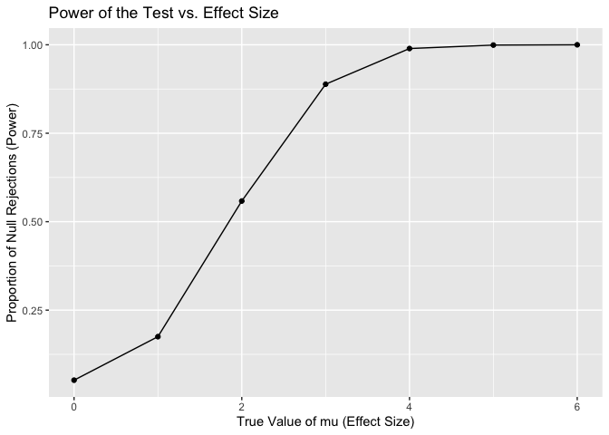

p8105_hw5_rw3033
================

# Question 1

``` r
# Function to check if there are duplicate birthdays in a group
duplicated_birthday = function(n) {
  birthdays = sample(1:365, n, replace = TRUE) 
  return(any(duplicated(birthdays))) 
}

# Run the function 10000 times
sim_function = function() {
  group_sizes = 2:50
  simulation = 10000
  probabilities = numeric(length(group_sizes))
  
  # Run the simulation 10000 times and compute the probability
  for (i in seq_along(group_sizes)) {
    group_size = group_sizes[i]
    results = replicate(simulation, duplicated_birthday(group_size))
    probabilities[i] = mean(results)
  }
  
  # Create a plot
  plot(group_sizes, probabilities, type = "b", 
       xlab = "Group Size", ylab = "Probability of Shared Birthday",
       main = "Probability of at Least Two People Sharing a Birthday")
  
  return(probabilities)
}

# Run the simulation
sim_function()
```

<!-- -->

    ##  [1] 0.0023 0.0092 0.0153 0.0257 0.0363 0.0549 0.0751 0.0976 0.1171 0.1400
    ## [11] 0.1674 0.1981 0.2183 0.2492 0.2813 0.3143 0.3440 0.3762 0.4140 0.4397
    ## [21] 0.4709 0.5068 0.5439 0.5654 0.5978 0.6259 0.6490 0.6837 0.7001 0.7258
    ## [31] 0.7555 0.7716 0.7897 0.8117 0.8359 0.8454 0.8627 0.8829 0.8900 0.9042
    ## [41] 0.9139 0.9227 0.9383 0.9403 0.9490 0.9573 0.9604 0.9655 0.9680

# Problem 2

``` r
library(dplyr)
```

    ## 
    ## Attaching package: 'dplyr'

    ## The following objects are masked from 'package:stats':
    ## 
    ##     filter, lag

    ## The following objects are masked from 'package:base':
    ## 
    ##     intersect, setdiff, setequal, union

``` r
# Simulation function
simulate_df = function(mu_values, n = 30, sigma = 5) {
  results = vector("list", length(mu_values))
  
  for (i in seq_along(mu_values)) {  # Use seq_along for proper indexing
    mu = mu_values[i]  # Access the current mu value
    
    # Simulate datasets and perform t-tests
    simulation_results = replicate(5000, {
      x = rnorm(n, mean = mu, sd = sigma) 
      t_test = broom::tidy(t.test(x, mu = 0)) 
      c(mu = mu, estimate = t_test[["estimate"]], p_value = t_test[["p.value"]])
    }, simplify = FALSE)
    
    # Combine simulation results into a data frame for this mu=i
    results[[i]] = bind_rows(simulation_results)
  }
  
  # Combine all results into one data frame
  results_df = bind_rows(results)
}

# Repeat for μ = {0, 1, 2, 3, 4, 5, 6}
mu_values = seq(0, 6, by = 1)
results = simulate_df(mu_values) |>
  rename(estimate = `estimate.mean of x`)
```

``` r
library(ggplot2)

# Data cleaning for the plot
test_results = results |>
  group_by(mu) |>
  summarise(
    rejections = sum(p_value < 0.05),
    power = rejections / 5000,
    avg_estimate_all = mean(estimate),
    avg_estimate_rejected = mean(estimate[p_value < 0.05])
  )
```

``` r
# Make a plot showing the proportion of times the null was rejected
ggplot(test_results, aes(x = mu, y = power)) +
  geom_point() +  
  geom_line() +  
  labs(
    title = "Power of the Test vs. Effect Size",
    x = "True Value of mu (Effect Size)",
    y = "Proportion of Null Rejections (Power)"
  )
```

<!-- -->

``` r
# Make a plot showing the average estimate
ggplot(test_results, aes(x = mu, y = avg_estimate_all)) +
  geom_point() +  
  geom_line() +  
  geom_text(aes(
      label = paste0("(", round(mu, 1), ", ", round(avg_estimate_all, 4), ")")), 
      vjust = -1) +
  labs(
    title = "True mu vs. Estimate mu",
    x = "True Value of mu",
    y = "Mean Estimate Value of mu"
  )
```

<!-- -->

``` r
# Make a plot showing the average estimate only in samples for which the null was rejected
ggplot(test_results, aes(x = mu, y = avg_estimate_rejected)) +
  geom_point() + 
  geom_line() +  
  geom_text(aes(
      label = paste0("(", round(mu, 1), ", ", round(avg_estimate_rejected, 4), ")")), 
      vjust = -1) +
  labs(
    title = "True mu vs. Estimate rejected mu",
    x = "True Value of mu",
    y = "Mean Estimate Value of rejected mu"
  )
```

<!-- -->
Comment: No, the sample average of mu across tests for which the null
hypothesis is rejected is not approximately equal to the true value of
mu. The reason is that the second plot shows the average estimate of mu
for rejected tests only not mu across all samples.
